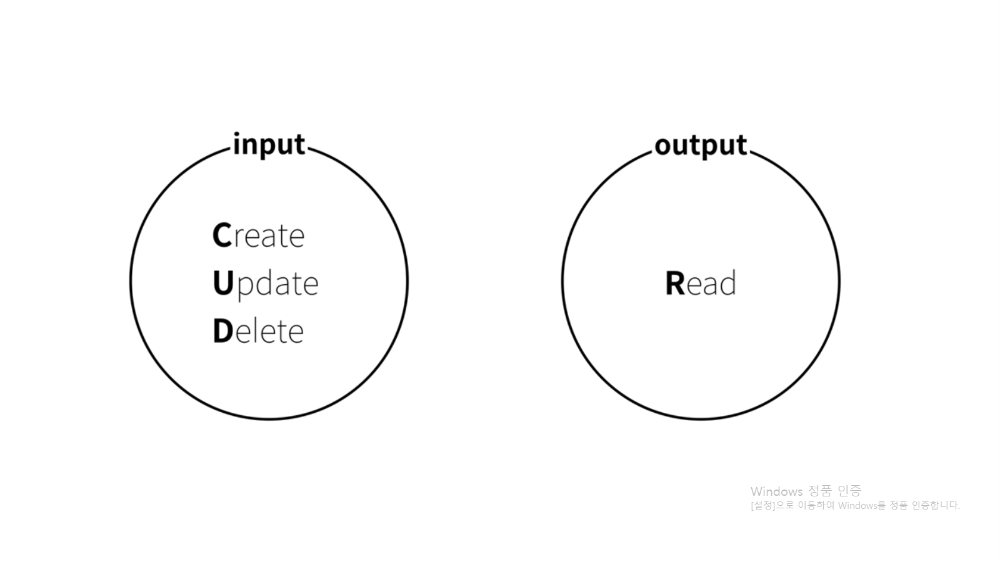

# Database

## 1. 수업소개

정보 기술의 심장

데이터 중요한 이유 -> 가공하여 다양한 일 수행

데이터 저장, 불러오기를 위해선?  
- file - 그러나, 성능, 보안, 편의성의 한계  
- database - file의 한계를 극복하기 위해 고안된 전문화된 소프트웨어

ex)  
MySQL  
Oracle  
SQL Server  
PostgreSQL  
MongoDB  

## 2. 데이터베이스의 본질

데이터베이스의 데이터를 어떻게 input하고 어떻게 output하는지 따져봐야 한다.

